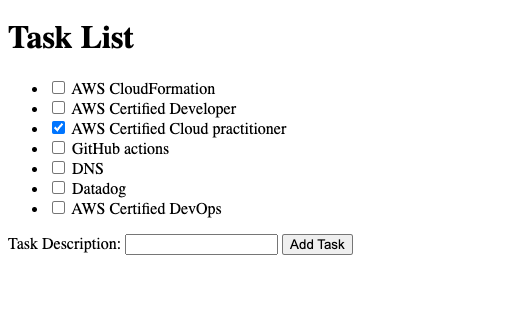

Certainly! Here's the content for a single file named `README.md`:

```markdown
# Flask Task Management App

This is a simple Flask app for task management, where users can view a list of tasks, mark tasks as completed, and add new tasks.




## Installation

1. Clone the repository:

2. Create a virtual environment and activate it:

   ```bash
   python -m venv venv
   # On Windows
   venv\Scripts\activate
   # On macOS/Linux
   source venv/bin/activate
   ```

3. Install the required dependencies:

   ```bash
   pip install -r requirements.txt
   ```

4. Run the Flask app:

   ```bash
   python app.py
   ```

   The app will be accessible at http://127.0.0.1:5000/ in your web browser.

## User Interface


*Screenshot of the Task Management UI*

## Usage

- Navigate to http://127.0.0.1:5000/ in your web browser.
- View the list of tasks, mark tasks as completed, and add new tasks.

## Contributing

Feel free to contribute by opening issues or submitting pull requests.

## License

This project is licensed under the MIT License - see the [LICENSE](LICENSE) file for details.
```
